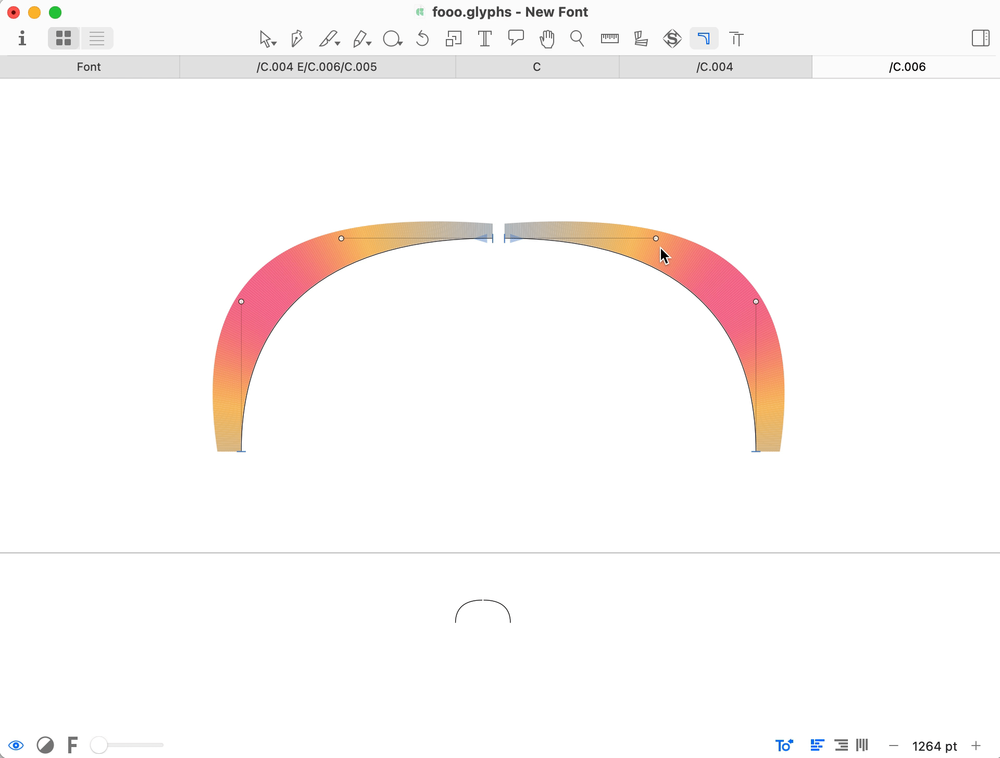

# Harmonic move

Harmonic move is a [Glyphs](https://glyphsapp.com) plugin.  

The plugin will scale an opposite handle to maintain the same curvature level when selected handle changes.

For example, the plugin can be used to change the weight of terminals:

